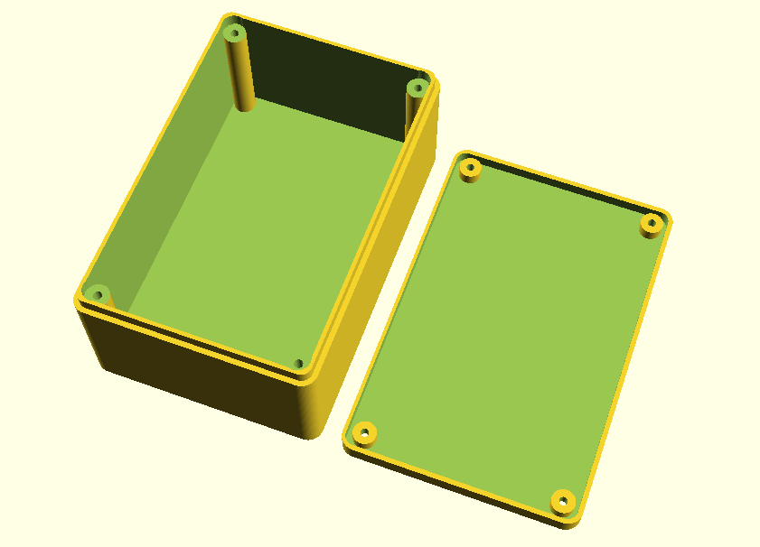

# parametric-openscad-box
OpenSCAD parametric box for electronic projects, based on [smooth-prim](https://github.com/rcolyer/smooth-prim).

Checkout with:
```
git clone --recurse-submodules https://github.com/chrisb2/parametric-openscad-box.git
```


